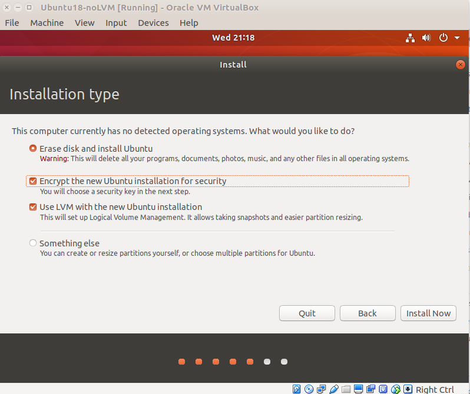
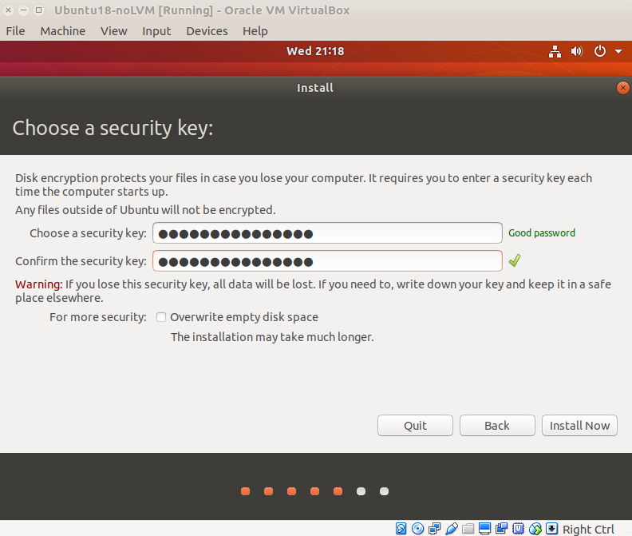
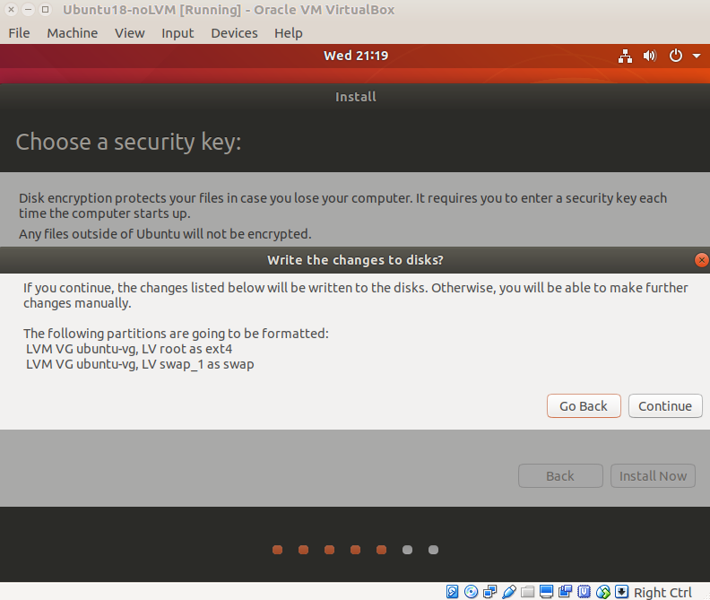
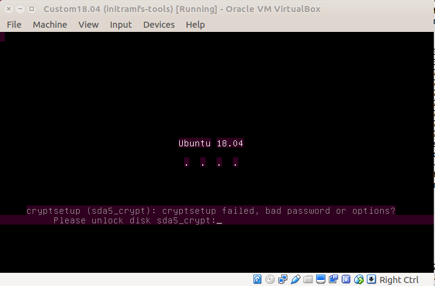
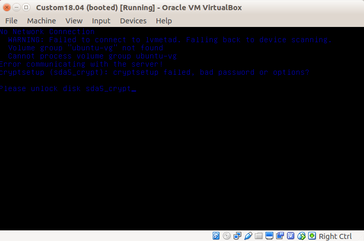

# Starting from an Ubuntu install with encryption








````
root@cisadmin-VirtualBox:~# cryptsetup luksDump /dev/sda5
LUKS header information for /dev/sda5

Version:       	1
Cipher name:   	aes
Cipher mode:   	xts-plain64
Hash spec:     	sha256
Payload offset:	4096
MK bits:       	512
MK digest:     	59 ec 7e 52 51 87 55 c7 7c be 2c 77 81 5e 7a 88 5d 42 4c a2 
MK salt:       	28 f7 ea 4e d1 47 49 4d 8b 4b df 9a c2 dd 30 c3 
               	ea f2 28 0f b6 03 5a 61 f4 16 f6 2c ae cc af 98 
MK iterations: 	76471
UUID:          	dadcca31-8e39-4ea2-9e4c-1f5b2849d26b

Key Slot 0: ENABLED
	Iterations:         	1223542
	Salt:               	64 73 3c 1b 46 df db 36 fc ec 80 97 b0 d7 7a 46 
	                      	f3 73 82 8b 59 2b 16 ce dd 1d 13 1f 00 54 c1 7a 
	Key material offset:	8
	AF stripes:            	4000
Key Slot 1: DISABLED
Key Slot 2: DISABLED
Key Slot 3: DISABLED
Key Slot 4: DISABLED
Key Slot 5: DISABLED
Key Slot 6: DISABLED
Key Slot 7: DISABLED
root@cisadmin-VirtualBox:~#
````

````
root@cisadmin-VirtualBox:~# cat /etc/crypttab 
sda5_crypt UUID=dadcca31-8e39-4ea2-9e4c-1f5b2849d26b none luks,discard
````

````
root@cisadmin-VirtualBox:~# cat /etc/fstab 
# /etc/fstab: static file system information.
#
# Use 'blkid' to print the universally unique identifier for a
# device; this may be used with UUID= as a more robust way to name devices
# that works even if disks are added and removed. See fstab(5).
#
# <file system> <mount point>   <type>  <options>       <dump>  <pass>
/dev/mapper/ubuntu--vg-root /               ext4    errors=remount-ro 0       1
# /boot was on /dev/sda1 during installation
UUID=4f2164a1-8734-484d-83ed-c7ad21b4416f /boot           ext4    defaults        0       2
/dev/mapper/ubuntu--vg-swap_1 none            swap    sw              0       0
root@cisadmin-VirtualBox:~#
````


# Setup _netdev
````
root@cisadmin-VirtualBox:~# cat /etc/fstab 
# /etc/fstab: static file system information.
#
# Use 'blkid' to print the universally unique identifier for a
# device; this may be used with UUID= as a more robust way to name devices
# that works even if disks are added and removed. See fstab(5).
#
# <file system> <mount point>   <type>  <options>       <dump>  <pass>
/dev/mapper/ubuntu--vg-root /               ext4    errors=remount-ro,_netdev 0       1
# /boot was on /dev/sda1 during installation
UUID=4e7a63b9-6055-4b3a-ba11-b95476bd212a /boot           ext4    defaults        0       2
/dev/mapper/ubuntu--vg-swap_1 none            swap    sw              0       0
````
````
root@cisadmin-VirtualBox:~# cat /etc/crypttab 
sda5_crypt UUID=52dce006-353f-42fe-97f5-3d1939ecdfec none luks,discard,_netdev
root@cisadmin-VirtualBox:~#
````

````
sudo apt-get install clevis clevis-luks
Reading package lists... Done
Building dependency tree       
Reading state information... Done
The following additional packages will be installed:
  curl jose libcurl4 libjose0 libluksmeta0 libpwquality-tools luksmeta
The following NEW packages will be installed:
  clevis clevis-luks url jose libcurl4 libjose0 libluksmeta0 libpwquality-tools luksmeta
0 upgraded, 8 newly installed, 0 to remove and 0 not upgraded.
Need to get 504 kB of archives.
After this operation, 1,528 kB of additional disk space will be used.
Do you want to continue? [Y/n] Y
````

````
root@cisadmin-VirtualBox:~# lsblk
NAME                    MAJ:MIN RM   SIZE RO TYPE  MOUNTPOINT
loop0                     7:0    0 140.9M  1 loop  /snap/gnome-3-26-1604/70
loop1                     7:1    0  34.7M  1 loop  /snap/gtk-common-themes/319
loop2                     7:2    0   3.7M  1 loop  /snap/gnome-system-monitor/51
loop3                     7:3    0  86.9M  1 loop  /snap/core/4917
loop4                     7:4    0  14.5M  1 loop  /snap/gnome-logs/37
loop5                     7:5    0   2.3M  1 loop  /snap/gnome-calculator/180
loop6                     7:6    0    13M  1 loop  /snap/gnome-characters/103
loop7                     7:7    0  87.9M  1 loop  /snap/core/5662
loop8                     7:8    0   2.3M  1 loop  /snap/gnome-calculator/238
loop9                     7:9    0   3.7M  1 loop  /snap/gnome-system-monitor/57
loop10                    7:10   0    13M  1 loop  /snap/gnome-characters/124
loop11                    7:11   0  14.5M  1 loop  /snap/gnome-logs/45
loop12                    7:12   0  42.1M  1 loop  /snap/gtk-common-themes/701
loop13                    7:13   0 140.7M  1 loop  /snap/gnome-3-26-1604/74
sda                       8:0    0    10G  0 disk  
├─sda1                    8:1    0   731M  0 part  /boot
├─sda2                    8:2    0     1K  0 part  
└─sda5                    8:5    0   9.3G  0 part  
  └─sda5_crypt          253:0    0   9.3G  0 crypt 
    ├─ubuntu--vg-root   253:1    0   8.3G  0 lvm   /
    └─ubuntu--vg-swap_1 253:2    0   980M  0 lvm   [SWAP]
sr0                      11:0    1  1024M  0 rom   
````
````
root@cisadmin-VirtualBox:~# cryptsetup luksDump /dev/sda5
LUKS header information for /dev/sda5

Version:       	1
Cipher name:   	aes
Cipher mode:   	xts-plain64
Hash spec:     	sha256
Payload offset:	4096
MK bits:       	512
MK digest:     	c5 2c a0 78 17 a2 64 c1 57 a8 fd d7 c5 14 84 84 89 09 11 2f 
MK salt:       	27 0c 45 e9 9a 07 e6 2a be 43 67 84 65 72 97 ac 
               	c4 67 ce 90 5a f8 4e 0c d3 68 f1 8f aa 77 d1 ad 
MK iterations: 	80019
UUID:          	52dce006-353f-42fe-97f5-3d1939ecdfec

Key Slot 0: ENABLED
	Iterations:         	1280312
	Salt:               	60 12 b0 d3 09 61 7f 2d 5a f1 86 2c d3 57 a3 df 
	                      	57 91 74 f2 b2 b0 9c 3d 6b bd 40 36 60 01 f4 ef 
	Key material offset:	8
	AF stripes:            	4000
Key Slot 1: DISABLED
Key Slot 2: DISABLED
Key Slot 3: DISABLED
Key Slot 4: DISABLED
Key Slot 5: DISABLED
Key Slot 6: DISABLED
Key Slot 7: DISABLED
root@cisadmin-VirtualBox:~#
````

BIND LUKS to TANG Server: TANG1
````
# clevis bind luks -d /dev/sdb1 tang '{"url":"http://10.0.2.11:80"}'
clevis bind luks -d /dev/sda5 tang '{"url":"http://10.0.2.11:80"}'
````

````
root@cisadmin-VirtualBox:~# clevis bind luks -d /dev/sda5 tang '{"url":"http://10.0.2.11:80"}'
The advertisement contains the following signing keys:

58zNmxhZPGEIIPQcQrrV5IDqaOg

Do you wish to trust these keys? [ynYN] Y
You are about to initialize a LUKS device for metadata storage.
Attempting to initialize it may result in data loss if data was
already written into the LUKS header gap in a different format.
A backup is advised before initialization is performed.

Do you wish to initialize /dev/sda5? [yn] Y
Enter existing LUKS password: 
root@cisadmin-VirtualBox:~#
````

````
root@cisadmin-VirtualBox:~# cryptsetup luksDump /dev/sda5
LUKS header information for /dev/sda5

Version:       	1
Cipher name:   	aes
Cipher mode:   	xts-plain64
Hash spec:     	sha256
Payload offset:	4096
MK bits:       	512
MK digest:     	c5 2c a0 78 17 a2 64 c1 57 a8 fd d7 c5 14 84 84 89 09 11 2f 
MK salt:       	27 0c 45 e9 9a 07 e6 2a be 43 67 84 65 72 97 ac 
               	c4 67 ce 90 5a f8 4e 0c d3 68 f1 8f aa 77 d1 ad 
MK iterations: 	80019
UUID:          	52dce006-353f-42fe-97f5-3d1939ecdfec

Key Slot 0: ENABLED
	Iterations:         	1280312
	Salt:               	60 12 b0 d3 09 61 7f 2d 5a f1 86 2c d3 57 a3 df 
	                      	57 91 74 f2 b2 b0 9c 3d 6b bd 40 36 60 01 f4 ef 
	Key material offset:	8
	AF stripes:            	4000
Key Slot 1: ENABLED
	Iterations:         	1106092
	Salt:               	93 c6 ac 47 c9 a1 36 9b c8 b2 af 06 58 b1 e9 69 
	                      	61 37 a2 97 1a 5b cb f8 5d 68 99 ea 35 80 99 a4 
	Key material offset:	512
	AF stripes:            	4000
Key Slot 2: DISABLED
Key Slot 3: DISABLED
Key Slot 4: DISABLED
Key Slot 5: DISABLED
Key Slot 6: DISABLED
Key Slot 7: DISABLED
root@cisadmin-VirtualBox:~#
````

````
sudo vi /etc/apt/sources.list
````

Uncomment the following deb-src lines:
````
## N.B. software from this repository is ENTIRELY UNSUPPORTED by the Ubuntu
## team. Also, please note that software in universe WILL NOT receive any
## review or updates from the Ubuntu security team.
deb http://us.archive.ubuntu.com/ubuntu/ bionic universe
deb-src http://us.archive.ubuntu.com/ubuntu/ bionic universe
deb http://us.archive.ubuntu.com/ubuntu/ bionic-updates universe
deb-src http://us.archive.ubuntu.com/ubuntu/ bionic-updates universe
````

````
sudo apt-get update
````

````
./build.sh
````

````
cisadmin@cisadmin-VirtualBox:~$ ./build.sh 
Reading package lists... Done
Building dependency tree       
Reading state information... Done
quilt is already the newest version (0.63-8.2).
0 upgraded, 0 newly installed, 0 to remove and 0 not upgraded.
Reading package lists... Done
Building dependency tree       
Reading state information... Done
libaudit-dev is already the newest version (1:2.8.2-1ubuntu1).
libjose-dev is already the newest version (10-2build1).
libluksmeta-dev is already the newest version (8-3build1).
tang is already the newest version (6-1).
debhelper is already the newest version (11.1.6ubuntu2).
libglib2.0-dev is already the newest version (2.56.2-0ubuntu0.18.04.2).
libssl-dev is already the newest version (1.1.0g-2ubuntu4.1).
libudisks2-dev is already the newest version (2.7.6-3ubuntu0.2).
0 upgraded, 0 newly installed, 0 to remove and 0 not upgraded.
Reading package lists... Done
Need to get 140 kB of source archives.
Get:1 http://us.archive.ubuntu.com/ubuntu bionic/universe clevis 8-1 (dsc) [2,115 B]
Get:2 http://us.archive.ubuntu.com/ubuntu bionic/universe clevis 8-1 (tar) [134 kB]
Get:3 http://us.archive.ubuntu.com/ubuntu bionic/universe clevis 8-1 (diff) [4,064 B]
Fetched 140 kB in 0s (328 kB/s)    
dpkg-source: info: extracting clevis in clevis-8
dpkg-source: info: unpacking clevis_8.orig.tar.bz2
dpkg-source: info: unpacking clevis_8-1.debian.tar.xz
dpkg-source: info: applying cherry-pick.v8-1-g69524aa.fix-typo-in-libaudit-requirement.patch
dpkg-source: info: applying test-exec-path.patch
dpkg-source: info: applying disable-dracut-check.patch
dpkg-source: info: applying fix-manpage-add-name.patch
dpkg-source: info: applying use-socat.patch
clevis/
clevis/clevis_8-1.debian.tar.xz
clevis/clevis_8.orig.tar.bz2
clevis/clevis_8-1.dsc
clevis/clevis-8/
clevis/clevis-8/compile
clevis/clevis-8/src/
clevis/clevis-8/src/dracut/
clevis/clevis-8/src/dracut/Makefile.in
clevis/clevis-8/src/dracut/module-setup.sh.in
clevis/clevis-8/src/dracut/Makefile.am
clevis/clevis-8/src/dracut/clevis-hook.sh.in
clevis/clevis-8/src/clevis-encrypt-tang
clevis/clevis-8/src/udisks2/
clevis/clevis-8/src/udisks2/Makefile.in
clevis/clevis-8/src/udisks2/clevis-luks-udisks2.desktop.in
clevis/clevis-8/src/udisks2/Makefile.am
clevis/clevis-8/src/udisks2/clevis-luks-udisks2.c
clevis/clevis-8/src/clevis-encrypt-test
clevis/clevis-8/src/clevis-decrypt-sss.c
clevis/clevis-8/src/sss.c
clevis/clevis-8/src/clevis-luks-bind
clevis/clevis-8/src/Makefile.in
clevis/clevis-8/src/systemd/
clevis/clevis-8/src/systemd/Makefile.in
clevis/clevis-8/src/systemd/clevis-luks-askpass
clevis/clevis-8/src/systemd/Makefile.am
clevis/clevis-8/src/systemd/clevis-luks-askpass.path
clevis/clevis-8/src/systemd/clevis-luks-askpass.service.in
clevis/clevis-8/src/initramfs-tools/
clevis/clevis-8/src/initramfs-tools/scripts/
clevis/clevis-8/src/initramfs-tools/scripts/local-bottom/
clevis/clevis-8/src/initramfs-tools/scripts/local-bottom/clevis.in
clevis/clevis-8/src/initramfs-tools/scripts/local-top/
clevis/clevis-8/src/initramfs-tools/scripts/local-top/clevis.in
clevis/clevis-8/src/initramfs-tools/Makefile.am
clevis/clevis-8/src/initramfs-tools/hooks/
clevis/clevis-8/src/initramfs-tools/hooks/clevis.in
clevis/clevis-8/src/clevis-bind-luks
clevis/clevis-8/src/clevis-decrypt-tang
clevis/clevis-8/src/clevis-decrypt
clevis/clevis-8/src/clevis
clevis/clevis-8/src/Makefile.am
clevis/clevis-8/src/clevis-encrypt-sss.c
clevis/clevis-8/src/clevis-encrypt-http
clevis/clevis-8/src/clevis-decrypt-http
clevis/clevis-8/src/clevis-decrypt-test
clevis/clevis-8/src/clevis-luks-unlock
clevis/clevis-8/src/sss.h
clevis/clevis-8/Makefile.in
clevis/clevis-8/configure
clevis/clevis-8/missing
clevis/clevis-8/COPYING
clevis/clevis-8/depcomp
clevis/clevis-8/.pc/
clevis/clevis-8/.pc/applied-patches
clevis/clevis-8/.pc/.version
clevis/clevis-8/.pc/disable-dracut-check.patch/
clevis/clevis-8/.pc/disable-dracut-check.patch/configure.ac
clevis/clevis-8/.pc/.quilt_patches
clevis/clevis-8/.pc/cherry-pick.v8-1-g69524aa.fix-typo-in-libaudit-requirement.patch/
clevis/clevis-8/.pc/cherry-pick.v8-1-g69524aa.fix-typo-in-libaudit-requirement.patch/configure.ac
clevis/clevis-8/.pc/.quilt_series
clevis/clevis-8/.pc/add_ubuntu_support.patch/
clevis/clevis-8/.pc/add_ubuntu_support.patch/src/
clevis/clevis-8/.pc/add_ubuntu_support.patch/src/initramfs-tools/
clevis/clevis-8/.pc/add_ubuntu_support.patch/src/initramfs-tools/scripts/
clevis/clevis-8/.pc/add_ubuntu_support.patch/src/initramfs-tools/scripts/local-bottom/
clevis/clevis-8/.pc/add_ubuntu_support.patch/src/initramfs-tools/scripts/local-bottom/clevis.in
clevis/clevis-8/.pc/add_ubuntu_support.patch/src/initramfs-tools/scripts/local-top/
clevis/clevis-8/.pc/add_ubuntu_support.patch/src/initramfs-tools/scripts/local-top/clevis.in
clevis/clevis-8/.pc/add_ubuntu_support.patch/src/initramfs-tools/Makefile.am
clevis/clevis-8/.pc/add_ubuntu_support.patch/src/initramfs-tools/hooks/
clevis/clevis-8/.pc/add_ubuntu_support.patch/src/initramfs-tools/hooks/clevis.in
clevis/clevis-8/.pc/add_ubuntu_support.patch/src/Makefile.am
clevis/clevis-8/.pc/add_ubuntu_support.patch/.timestamp
clevis/clevis-8/.pc/add_ubuntu_support.patch/configure.ac
clevis/clevis-8/.pc/add_ubuntu_support.patch/Makefile.am
clevis/clevis-8/.pc/test-exec-path.patch/
clevis/clevis-8/.pc/test-exec-path.patch/tests/
clevis/clevis-8/.pc/test-exec-path.patch/tests/pin-tang
clevis/clevis-8/.pc/fix-manpage-add-name.patch/
clevis/clevis-8/.pc/fix-manpage-add-name.patch/doc/
clevis/clevis-8/.pc/fix-manpage-add-name.patch/doc/clevis-luks-unlockers.7
clevis/clevis-8/.pc/use-socat.patch/
clevis/clevis-8/.pc/use-socat.patch/src/
clevis/clevis-8/.pc/use-socat.patch/src/dracut/
clevis/clevis-8/.pc/use-socat.patch/src/dracut/module-setup.sh.in
clevis/clevis-8/.pc/use-socat.patch/src/systemd/
clevis/clevis-8/.pc/use-socat.patch/src/systemd/clevis-luks-askpass
clevis/clevis-8/config.sub
clevis/clevis-8/debian/
clevis/clevis-8/debian/control
clevis/clevis-8/debian/rules
clevis/clevis-8/debian/clevis.manpages
clevis/clevis-8/debian/clevis.install
clevis/clevis-8/debian/clevis-luks.install
clevis/clevis-8/debian/clevis-systemd.install
clevis/clevis-8/debian/clevis-dracut.install
clevis/clevis-8/debian/watch
clevis/clevis-8/debian/changelog
clevis/clevis-8/debian/source/
clevis/clevis-8/debian/source/format
clevis/clevis-8/debian/clevis-udisks2.install
clevis/clevis-8/debian/copyright
clevis/clevis-8/debian/patches/
clevis/clevis-8/debian/patches/series
clevis/clevis-8/debian/patches/add_ubuntu_support.patch~
clevis/clevis-8/debian/patches/disable-dracut-check.patch
clevis/clevis-8/debian/patches/cherry-pick.v8-1-g69524aa.fix-typo-in-libaudit-requirement.patch
clevis/clevis-8/debian/patches/add_ubuntu_support.patch
clevis/clevis-8/debian/patches/test-exec-path.patch
clevis/clevis-8/debian/patches/fix-manpage-add-name.patch
clevis/clevis-8/debian/patches/use-socat.patch
clevis/clevis-8/debian/clevis-luks.manpages
clevis/clevis-8/debian/compat
clevis/clevis-8/configure.ac
clevis/clevis-8/test-driver
clevis/clevis-8/aclocal.m4
clevis/clevis-8/doc/
clevis/clevis-8/doc/clevis-luks-unlock.1
clevis/clevis-8/doc/clevis-encrypt-tang.1
clevis/clevis-8/doc/clevis-luks-unlockers.7
clevis/clevis-8/doc/clevis-encrypt-sss.1
clevis/clevis-8/doc/clevis-encrypt-http.1
clevis/clevis-8/doc/clevis-decrypt.1
clevis/clevis-8/doc/clevis-luks-bind.1
clevis/clevis-8/doc/clevis.1
clevis/clevis-8/Makefile.am
clevis/clevis-8/config.guess
clevis/clevis-8/install-sh
clevis/clevis-8/tests/
clevis/clevis-8/tests/Makefile.in
clevis/clevis-8/tests/pin-http
clevis/clevis-8/tests/pin-httpd
clevis/clevis-8/tests/pin-sss
clevis/clevis-8/tests/Makefile.am
clevis/clevis-8/tests/pin-tang
clevis/clevis-8/tests/pin-test
Removing patch debian/patches/use-socat.patch
Restoring src/systemd/clevis-luks-askpass
Restoring src/dracut/module-setup.sh.in

Removing patch debian/patches/fix-manpage-add-name.patch
Restoring doc/clevis-luks-unlockers.7

Removing patch debian/patches/disable-dracut-check.patch
Restoring configure.ac

Removing patch debian/patches/test-exec-path.patch
Restoring tests/pin-tang

Removing patch debian/patches/cherry-pick.v8-1-g69524aa.fix-typo-in-libaudit-requirement.patch
Restoring configure.ac

No patches applied
Applying patch debian/patches/cherry-pick.v8-1-g69524aa.fix-typo-in-libaudit-requirement.patch
patching file configure.ac

Applying patch debian/patches/test-exec-path.patch
patching file tests/pin-tang

Applying patch debian/patches/disable-dracut-check.patch
patching file configure.ac

Applying patch debian/patches/fix-manpage-add-name.patch
patching file doc/clevis-luks-unlockers.7

Applying patch debian/patches/use-socat.patch
patching file src/dracut/module-setup.sh.in
patching file src/systemd/clevis-luks-askpass

Now at patch debian/patches/use-socat.patch
Patch debian/patches/add_ubuntu_support.patch is now on top
File Makefile.am added to patch debian/patches/add_ubuntu_support.patch
File configure.ac added to patch debian/patches/add_ubuntu_support.patch
File src/Makefile.am added to patch debian/patches/add_ubuntu_support.patch
File src/initramfs-tools/Makefile.am added to patch debian/patches/add_ubuntu_support.patch
File src/initramfs-tools/hooks/clevis.in added to patch debian/patches/add_ubuntu_support.patch
File src/initramfs-tools/scripts/local-bottom/clevis.in added to patch debian/patches/add_ubuntu_support.patch
File src/initramfs-tools/scripts/local-top/clevis.in added to patch debian/patches/add_ubuntu_support.patch
Nothing in patch debian/patches/add_ubuntu_support.patch
Refreshed patch debian/patches/add_ubuntu_support.patch
cisadmin@cisadmin-VirtualBox:~$
````


````
compile.sh
````

````
#!/bin/bash
cd ~/clevis/clevis-8
autoreconf -si
./configure --prefix=/usr --with-initramfstoolsmodulesdir=/usr/share/initramfs-tools/ --libexecdir=/usr/local/libexec
sudo make clean
sudo make install
sudo update-initramfs -u -k 'all'
sudo update-grub
sudo reboot
````

````
cd ~/clevis/clevis-8
````

````
autoreconf -si
````

````
cisadmin@cisadmin-VirtualBox:~/clevis/clevis-8$ ./configure --prefix=/usr --with-initramfstoolsmodulesdir=/usr/share/initramfs-tools/ --libexecdir=/usr/local/libexec
checking build system type... x86_64-pc-linux-gnu
checking host system type... x86_64-pc-linux-gnu
checking target system type... x86_64-pc-linux-gnu
checking for gcc... gcc
checking whether the C compiler works... yes
checking for C compiler default output file name... a.out
checking for suffix of executables... 
checking whether we are cross compiling... no
checking for suffix of object files... o
checking whether we are using the GNU C compiler... yes
checking whether gcc accepts -g... yes
checking for gcc option to accept ISO C89... none needed
checking whether gcc understands -c and -o together... yes
checking for gcc option to accept ISO C99... none needed
checking for ranlib... ranlib
checking for a sed that does not truncate output... /bin/sed
checking for a BSD-compatible install... /usr/bin/install -c
checking whether build environment is sane... yes
checking for a thread-safe mkdir -p... /bin/mkdir -p
checking for gawk... no
checking for mawk... mawk
checking whether make sets $(MAKE)... yes
checking for style of include used by make... GNU
checking whether make supports nested variables... yes
checking dependency style of gcc... gcc3
checking whether make supports nested variables... (cached) yes
checking for pkg-config... /usr/bin/pkg-config
checking pkg-config is at least version 0.25... yes
checking for luksmeta... yes
checking for libcrypto... yes
checking for jansson... yes
checking for udisks2... yes
checking for jose... yes
checking for systemd... yes
checking for audit... yes
checking for dracut... no
checking for update-initramfs... yes
checking for pwmake... yes
checking for systemd-socket-activate... /usr/bin/systemd-socket-activate
checking systemd-socket-activate inetd flag... --inetd
checking that generated files are newer than configure... done
configure: creating ./config.status
config.status: creating src/systemd/Makefile
config.status: creating src/udisks2/Makefile
config.status: creating src/dracut/Makefile
config.status: creating src/initramfs-tools/Makefile
config.status: creating tests/Makefile
config.status: creating src/Makefile
config.status: creating Makefile
config.status: executing depfiles commands
cisadmin@cisadmin-VirtualBox:~/clevis/clevis-8$
````

````
cisadmin@cisadmin-VirtualBox:~/clevis/clevis-8$ sudo make clean
Making clean in .
make[1]: Entering directory '/home/cisadmin/clevis/clevis-8'
make[1]: Nothing to be done for 'clean-am'.
make[1]: Leaving directory '/home/cisadmin/clevis/clevis-8'
Making clean in src
make[1]: Entering directory '/home/cisadmin/clevis/clevis-8/src'
Making clean in dracut
make[2]: Entering directory '/home/cisadmin/clevis/clevis-8/src/dracut'
test -z "clevis-hook.sh module-setup.sh" || rm -f clevis-hook.sh module-setup.sh
make[2]: Leaving directory '/home/cisadmin/clevis/clevis-8/src/dracut'
Making clean in initramfs-tools
make[2]: Entering directory '/home/cisadmin/clevis/clevis-8/src/initramfs-tools'
test -z "hooks/clevis scripts/local-bottom/clevis scripts/local-top/clevis" || rm -f hooks/clevis scripts/local-bottom/clevis scripts/local-top/clevis
make[2]: Leaving directory '/home/cisadmin/clevis/clevis-8/src/initramfs-tools'
Making clean in systemd
make[2]: Entering directory '/home/cisadmin/clevis/clevis-8/src/systemd'
test -z "clevis-luks-askpass.service" || rm -f clevis-luks-askpass.service
make[2]: Leaving directory '/home/cisadmin/clevis/clevis-8/src/systemd'
Making clean in udisks2
make[2]: Entering directory '/home/cisadmin/clevis/clevis-8/src/udisks2'
test -z "clevis-luks-udisks2.desktop" || rm -f clevis-luks-udisks2.desktop
test -z "clevis-luks-udisks2" || rm -f clevis-luks-udisks2
rm -f *.o
make[2]: Leaving directory '/home/cisadmin/clevis/clevis-8/src/udisks2'
Making clean in .
make[2]: Entering directory '/home/cisadmin/clevis/clevis-8/src'
test -z "clevis-encrypt-sss clevis-decrypt-sss" || rm -f clevis-encrypt-sss clevis-decrypt-sss
rm -f *.o
make[2]: Leaving directory '/home/cisadmin/clevis/clevis-8/src'
make[1]: Leaving directory '/home/cisadmin/clevis/clevis-8/src'
Making clean in tests
make[1]: Entering directory '/home/cisadmin/clevis/clevis-8/tests'
test -z "pin-test.log pin-http.log pin-sss.log pin-tang.log" || rm -f pin-test.log pin-http.log pin-sss.log pin-tang.log
test -z "pin-test.trs pin-http.trs pin-sss.trs pin-tang.trs" || rm -f pin-test.trs pin-http.trs pin-sss.trs pin-tang.trs
test -z "test-suite.log" || rm -f test-suite.log
make[1]: Leaving directory '/home/cisadmin/clevis/clevis-8/tests'
cisadmin@cisadmin-VirtualBox:~/clevis/clevis-8$
````

````
cisadmin@cisadmin-VirtualBox:~/clevis/clevis-8$ sudo make install
Making install in .
make[1]: Entering directory '/home/cisadmin/clevis/clevis-8'
make[2]: Entering directory '/home/cisadmin/clevis/clevis-8'
make[2]: Nothing to be done for 'install-exec-am'.
 /bin/mkdir -p '/usr/share/man/man1'
 /usr/bin/install -c -m 644 doc/clevis-encrypt-tang.1 doc/clevis-encrypt-http.1 doc/clevis-encrypt-sss.1 doc/clevis-luks-unlock.1 doc/clevis-luks-bind.1 doc/clevis-decrypt.1 doc/clevis.1 '/usr/share/man/man1'
 /bin/mkdir -p '/usr/share/man/man7'
 /usr/bin/install -c -m 644 doc/clevis-luks-unlockers.7 '/usr/share/man/man7'
make[2]: Leaving directory '/home/cisadmin/clevis/clevis-8'
make[1]: Leaving directory '/home/cisadmin/clevis/clevis-8'
Making install in src
make[1]: Entering directory '/home/cisadmin/clevis/clevis-8/src'
Making install in dracut
make[2]: Entering directory '/home/cisadmin/clevis/clevis-8/src/dracut'
  GEN      clevis-hook.sh
  GEN      clevis-hook.sh
  GEN      module-setup.sh
  GEN      module-setup.sh
make[3]: Entering directory '/home/cisadmin/clevis/clevis-8/src/dracut'
make[3]: Nothing to be done for 'install-exec-am'.
 /bin/mkdir -p '/60clevis'
 /usr/bin/install -c clevis-hook.sh module-setup.sh '/60clevis'
make[3]: Leaving directory '/home/cisadmin/clevis/clevis-8/src/dracut'
make[2]: Leaving directory '/home/cisadmin/clevis/clevis-8/src/dracut'
Making install in initramfs-tools
make[2]: Entering directory '/home/cisadmin/clevis/clevis-8/src/initramfs-tools'
  GEN      hooks/clevis
  GEN      hooks/clevis
  GEN      scripts/local-bottom/clevis
  GEN      scripts/local-bottom/clevis
  GEN      scripts/local-top/clevis
  GEN      scripts/local-top/clevis
make[3]: Entering directory '/home/cisadmin/clevis/clevis-8/src/initramfs-tools'
make[3]: Nothing to be done for 'install-exec-am'.
  GEN      install-nodist_initramfstoolsSCRIPTS
for i in hooks/clevis scripts/local-bottom/clevis scripts/local-top/clevis; do      \
	/bin/bash /home/cisadmin/clevis/clevis-8/install-sh -c -m 555 $i /usr/share/initramfs-tools//$i;    \
done
make[3]: Leaving directory '/home/cisadmin/clevis/clevis-8/src/initramfs-tools'
make[2]: Leaving directory '/home/cisadmin/clevis/clevis-8/src/initramfs-tools'
Making install in systemd
make[2]: Entering directory '/home/cisadmin/clevis/clevis-8/src/systemd'
  GEN      clevis-luks-askpass.service
  GEN      clevis-luks-askpass.service
make[3]: Entering directory '/home/cisadmin/clevis/clevis-8/src/systemd'
 /bin/mkdir -p '/usr/local/libexec'
 /usr/bin/install -c clevis-luks-askpass '/usr/local/libexec'
 /bin/mkdir -p '/lib/systemd/system'
 /usr/bin/install -c -m 644 clevis-luks-askpass.path '/lib/systemd/system'
 /bin/mkdir -p '/lib/systemd/system'
 /usr/bin/install -c -m 644 clevis-luks-askpass.service '/lib/systemd/system'
make[3]: Leaving directory '/home/cisadmin/clevis/clevis-8/src/systemd'
make[2]: Leaving directory '/home/cisadmin/clevis/clevis-8/src/systemd'
Making install in udisks2
make[2]: Entering directory '/home/cisadmin/clevis/clevis-8/src/udisks2'
  CC       clevis-luks-udisks2.o
  CCLD     clevis-luks-udisks2
  GEN      clevis-luks-udisks2.desktop
  GEN      clevis-luks-udisks2.desktop
make[3]: Entering directory '/home/cisadmin/clevis/clevis-8/src/udisks2'
 /bin/mkdir -p '/usr/local/libexec'
  /usr/bin/install -c clevis-luks-udisks2 '/usr/local/libexec'
 /bin/mkdir -p '/usr/etc/xdg/autostart'
 /usr/bin/install -c -m 644 clevis-luks-udisks2.desktop '/usr/etc/xdg/autostart'
make[3]: Leaving directory '/home/cisadmin/clevis/clevis-8/src/udisks2'
make[2]: Leaving directory '/home/cisadmin/clevis/clevis-8/src/udisks2'
Making install in .
make[2]: Entering directory '/home/cisadmin/clevis/clevis-8/src'
  CC       clevis-encrypt-sss.o
  CC       sss.o
  CCLD     clevis-encrypt-sss
  CC       clevis-decrypt-sss.o
  CCLD     clevis-decrypt-sss
make[3]: Entering directory '/home/cisadmin/clevis/clevis-8/src'
 /bin/mkdir -p '/usr/bin'
  /usr/bin/install -c clevis-encrypt-sss clevis-decrypt-sss '/usr/bin'
 /bin/mkdir -p '/usr/bin'
 /usr/bin/install -c clevis-encrypt-http clevis-encrypt-tang clevis-decrypt-http clevis-decrypt-tang clevis-bind-luks clevis-luks-unlock clevis-luks-bind clevis-decrypt clevis '/usr/bin'
make[3]: Nothing to be done for 'install-data-am'.
make[3]: Leaving directory '/home/cisadmin/clevis/clevis-8/src'
make[2]: Leaving directory '/home/cisadmin/clevis/clevis-8/src'
make[1]: Leaving directory '/home/cisadmin/clevis/clevis-8/src'
Making install in tests
make[1]: Entering directory '/home/cisadmin/clevis/clevis-8/tests'
make[2]: Entering directory '/home/cisadmin/clevis/clevis-8/tests'
make[2]: Nothing to be done for 'install-exec-am'.
make[2]: Nothing to be done for 'install-data-am'.
make[2]: Leaving directory '/home/cisadmin/clevis/clevis-8/tests'
make[1]: Leaving directory '/home/cisadmin/clevis/clevis-8/tests'
cisadmin@cisadmin-VirtualBox:~/clevis/clevis-8$
````


````
sudo update-initramfs -u -k 'all'
sudo update-grub
````

````
sudo reboot
````

Error upon reboot



However, Machine -> Reset, one time resulted in the machine unlocking properly next reboot.

Systemd issue?

````
cisadmin@cisadmin-VirtualBox:~$ dpkg -l | grep clevis
ii  clevis                                     8-1                                 amd64        automated encryption framework
ii  clevis-luks                                8-1                                 all          LUKSv1 integration for clevis
cisadmin@cisadmin-VirtualBox:~$
````

````
sudo apt-get install clevis-systemd
````

````
cisadmin@cisadmin-VirtualBox:~$ sudo apt-get install clevis-systemd
[sudo] password for cisadmin: 
Reading package lists... Done
Building dependency tree       
Reading state information... Done
The following additional packages will be installed:
  socat
The following NEW packages will be installed:
  clevis-systemd socat
0 upgraded, 2 newly installed, 0 to remove and 0 not upgraded.
Need to get 346 kB of archives.
After this operation, 1,057 kB of additional disk space will be used.
Do you want to continue? [Y/n] Y
````

And finally, enable clevis-luks-askpass.path
````
sudo systemctl enable clevis-luks-askpass.path
````

````
sudo reboot
````


````
sudo journalctl -xb -1 > lastsuccess.txt
sudo journalctl -xb -2 > lastfail.txt
````

````
sudo apt-get install clevis-udisks2
````

# Try with just udisk2

First reboot worked, subsequent reboots don't work..



````
No Network Connection
  WARNING: Failed to connect to lvmetad.  Falling back to device scanning.
  Volume group "ubuntu-vg" not found
  Cannot process volume group ubuntu-vg
Error communicating with the server!
cryptsetup (sda5_crypt): cryptsetup failed, bas password or options?

Please unlock disk sda5_crypt
````


Tang Server /var/log/messages log file:
(Old success display, no output on VM bootup)
````
Oct 25 10:46:49 localhost systemd: Started Tang Server (10.0.2.14:54696).
Oct 25 10:46:49 localhost systemd: Starting Tang Server (10.0.2.14:54696)...
Oct 25 10:46:50 localhost tangd: 10.0.2.14 POST /rec/YY_vJtV7HZM2BTFh2WTKTS1xIiA => 200 (src/tangd.c:168)
````